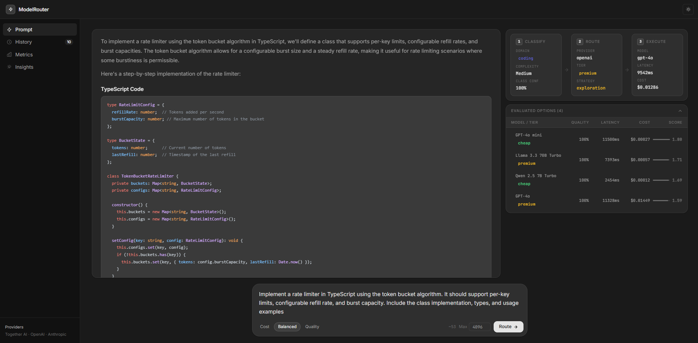
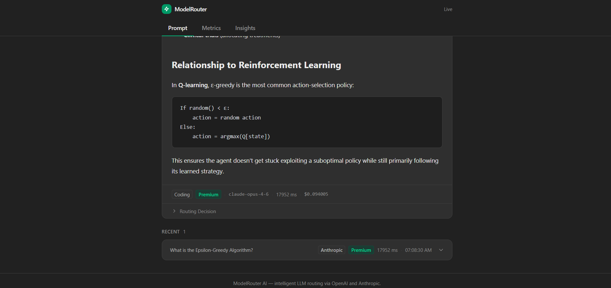
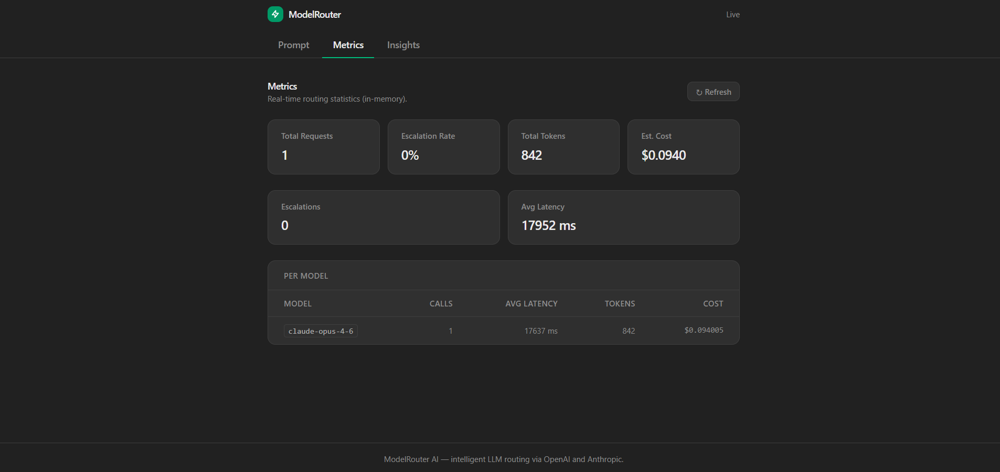
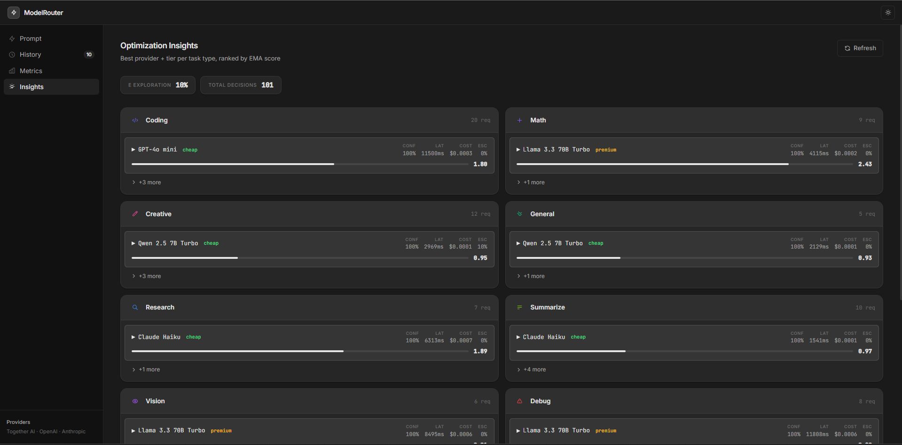

# ModelRouter AI

A self-optimizing LLM router that classifies every prompt, picks the cheapest capable model, and learns from every call — achieving **91.7% cost savings vs GPT-4o** at **100% classification accuracy** across 11 task domains.

---

## Benchmark Results

> 50-prompt suite · 11 domains · Together AI + OpenAI + Anthropic

| Metric | Result |
|--------|--------|
| Classification accuracy | **100%** (50/50 — easy + hard) |
| Cost savings vs GPT-4o | **91.7%** |
| Average cost per request | **$0.00018** (vs $0.00218 GPT-4o) |
| Escalation rate | **4%** |
| Average latency | **2414 ms** · p95 4401 ms |
| Errors | **0** |

74% of requests are served by Together AI Qwen 2.5 7B Turbo (~$73 µ each). The router escalates to premium models only when classifier confidence is low.

---

## Features

- **Hybrid classifier** — two-stage pipeline: fast regex signals (~0 ms) for clear prompts; nearest-neighbour embedding search (`text-embedding-3-small`) for ambiguous ones. Anchor vectors pre-loaded at startup so only the live prompt pays API latency (~150 ms).
- **11 task domains** — coding, coding_debug, math, math_reasoning, creative, general, general_chat, research, summarization, vision, multilingual
- **Together AI as primary provider** — serverless Turbo models (Qwen 2.5 7B/72B, Llama 3.3 70B, DeepSeek-V3, Llama 4 Maverick) routed by tier
- **Multi-provider fallback** — OpenAI and Anthropic as fallbacks; vision uses Llama 4 Maverick / GPT-4o; research escalates to Claude
- **Epsilon-greedy bandit** — 90% exploitation of Supabase performance data, 10% random exploration to discover better options
- **Domain-specific strategy weights** — each domain has tuned cost/latency/escalation weights so cheap models are not unfairly penalised
- **Margin-based confidence** — confidence = (top − second) / top, calibrated to 4–12% healthy escalation rate
- **Adaptive EMA learning** — exponential moving averages update per-model stats after every call

---

## Architecture

```
User Prompt
     ↓
HybridClassifier
  ├─ Stage 1: RuleBasedClassifier   (regex signals, ~0 ms, free)
  │       confidence ≥ 0.80 → fast path — skip embedding entirely
  └─ Stage 2: EmbeddingClassifier   (nearest-neighbour cosine similarity)
          maxSimilarity over ~120 anchor vectors across 11 domains
     ↓
StrategyEngine          (epsilon-greedy bandit, domain-specific weights)
  score = confWeight × avgConf − costWeight × normCost
        − latWeight  × normLat − escalWeight × escalRate
     ↓
ProviderManager         (resolves provider + tier → model ID)
     ↓
LLM Provider            (Together AI / OpenAI / Anthropic)
     ↓
PerformanceStore        (EMA update → Supabase)
```

---

## Tech Stack

| Layer     | Technology                                       |
|-----------|--------------------------------------------------|
| Frontend  | React 19, Vite, TypeScript, Tailwind CSS v4      |
| Backend   | Node.js, TypeScript, Express                     |
| AI        | Together AI, OpenAI API, Anthropic API           |
| Embeddings| OpenAI `text-embedding-3-small`                  |
| Database  | Supabase (PostgreSQL + EMA performance store)    |

---

## Project Structure

```
model-router-ai/
├── backend/
│   ├── src/
│   │   ├── config/
│   │   │   └── models.ts            MODEL_REGISTRY — canonical model IDs + tiers
│   │   ├── providers/
│   │   │   ├── togetherProvider.ts  Together AI (OpenAI-compatible endpoint)
│   │   │   ├── providerManager.ts   Multi-tier dispatch + model-ID resolution
│   │   │   ├── index.ts             ROUTING_TABLE — domain → provider mapping
│   │   │   └── types.ts             TaskDomain, ModelTier, shared types
│   │   ├── services/
│   │   │   ├── classifier.ts        Rule-based classifier (regex signals)
│   │   │   ├── embeddingClassifier.ts  Nearest-neighbour embedding classifier
│   │   │   ├── anchors.ts           ~120 anchor phrases across 11 domains
│   │   │   ├── strategyEngine.ts    Epsilon-greedy bandit with domain weights
│   │   │   ├── performanceStore.ts  EMA stats store (Supabase-backed)
│   │   │   └── router.ts            Main routing pipeline
│   │   ├── routes/
│   │   │   └── performance.ts       GET /performance endpoint
│   │   ├── scripts/
│   │   │   ├── benchmark.ts         50-prompt accuracy + cost benchmark
│   │   │   └── resetStats.ts        Clear Supabase perf data for fresh start
│   │   └── lib/
│   │       └── supabase.ts          Supabase client singleton
│   └── supabase/migrations/         SQL schema files (001–004)
├── frontend/
│   └── src/
│       ├── components/
│       │   ├── ResponsePanel.tsx    Routing decision + LLM output display
│       │   └── InsightsPanel.tsx    Per-domain best-model adaptive scores
│       ├── utils/
│       │   └── modelDisplay.ts      Cost/latency/tier formatting helpers
│       └── types.ts                 Mirrors backend types
└── docs/
    └── routing-strategy.md
```

---

## Getting Started

### Prerequisites

- Node.js 18+
- [OpenAI API key](https://platform.openai.com/api-keys) — for embeddings (`text-embedding-3-small`) and GPT-4o fallback
- [Anthropic API key](https://console.anthropic.com/settings/keys) — for Claude fallback on research/complex tasks
- [Together AI API key](https://api.together.xyz) — primary provider (cheap serverless models)
- [Supabase](https://supabase.com) project — performance persistence

### 1. Clone

```bash
git clone https://github.com/mohidf/ModelRouter.git
cd ModelRouter
```

### 2. Install dependencies

```bash
cd backend && npm install
cd ../frontend && npm install
```

### 3. Configure environment

```bash
cp backend/.env.example backend/.env
# Fill in: OPENAI_API_KEY, ANTHROPIC_API_KEY, TOGETHER_API_KEY,
#          SUPABASE_URL, SUPABASE_SERVICE_ROLE_KEY
```

Key optional variables:

| Variable | Default | Description |
|----------|---------|-------------|
| `CONFIDENCE_THRESHOLD` | `0.20` | Margin below which escalation fires |
| `ESCALATION_ENABLED` | `true` | Disable to always use primary model |
| `OPENAI_EMBEDDING_MODEL` | `text-embedding-3-small` | Embedding model for classifier |

### 4. Apply database migrations

Run the SQL files in `backend/supabase/migrations/` against your Supabase project in order (001 → 004).

### 5. Start

```bash
# Terminal 1
cd backend && npm run dev      # → http://localhost:3000

# Terminal 2
cd frontend && npm run dev     # → http://localhost:5173
```

---

## Available Scripts

### Backend (`/backend`)

| Script | Description |
|--------|-------------|
| `npm run dev` | nodemon + ts-node hot reload |
| `npm run build` | Compile TypeScript to `dist/` |
| `npm start` | Run compiled `dist/index.js` |
| `npm test` | Jest unit test suite |
| `npm run test:coverage` | Tests with coverage report |
| `npm run benchmark` | 50-prompt accuracy + cost benchmark |
| `npm run reset:stats` | Clear Supabase performance data |

### Frontend (`/frontend`)

| Script | Description |
|--------|-------------|
| `npm run dev` | Vite dev server with HMR |
| `npm run build` | Type-check + build to `dist/` |
| `npm run preview` | Preview production build |

---

## How It Works

### 1. Classify

The hybrid classifier assigns each prompt a `domain` (11 options) and `complexity` (low/medium/high).

**Fast path** — regex signals score the prompt in ~0 ms. If one domain's score dominates with confidence ≥ 0.80, the result is used immediately and the embedding is never called.

**Slow path** — for ambiguous prompts, `text-embedding-3-small` embeds the prompt and compares it against ~120 pre-computed anchor vectors (10–12 per domain) using **max cosine similarity** (nearest-neighbour). Max is used instead of mean so that a single exact-match anchor wins cleanly without being diluted by diverse anchors in the same domain.

**Confidence** is computed as `(top_score − second_score) / top_score`. Values above `CONFIDENCE_THRESHOLD` (default 0.20) are accepted directly; values below trigger escalation.

### 2. Route

The **StrategyEngine** scores every (provider, tier) combination using per-domain weights:

```
score = confidenceWeight × avgConfidence
      − costWeight       × normalisedCost
      − latencyWeight    × normalisedLatency
      − escalationWeight × escalationRate
```

With probability ε = 10% it randomly selects a different model to explore. Domain-specific `escalationWeight` values are kept low (0.2–0.8) so cheap models are not unfairly penalised when escalation was triggered by classifier uncertainty rather than model failure.

### 3. Learn

After every call, EMA-smoothed stats (confidence, cost, latency, escalation rate) are written to Supabase. Each subsequent request benefits from the updated data.

---

## API Endpoints

| Method | Path | Description |
|--------|------|-------------|
| `POST` | `/route` | Classify prompt and return LLM response |
| `GET` | `/metrics` | Aggregate request statistics |
| `GET` | `/performance` | Per-domain best-model insights |

### POST `/route`

```json
{
  "prompt": "Explain binary search trees",
  "maxTokens": 1024,
  "preferCost": false,
  "optimizationMode": "balanced"
}
```

`optimizationMode`: `"cost"` | `"balanced"` | `"quality"`

### Response shape

```json
{
  "content": "...",
  "provider": "together",
  "model": "Qwen/Qwen2.5-7B-Instruct-Turbo",
  "domain": "coding",
  "complexity": "low",
  "confidence": 0.94,
  "escalated": false,
  "cost": { "inputTokens": 45, "outputTokens": 312, "totalUsd": 0.0000731 },
  "latencyMs": 1842,
  "routingReason": "Together Qwen 2.5 7B for cost-efficient coding tasks"
}
```

---

## Screenshots

### Prompt — enter your query and routing options


### Response — markdown output with routing decision pipeline


### Metrics — live request statistics and per-model breakdown


### Insights — best provider per task type with adaptive scores


---

## License

[MIT](LICENSE)
